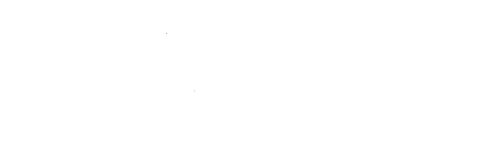

#  LeNova, Inc.

Visit [www.lenovainc.com](https://www.lenovainc.com) for professional engineering and technology solutions.

>**Skills Utilized**:
<ol>
    <li>Languages: HTML, CSS, JavaScript</li>
    <li>Responsive Web Design | Mobile First</li>
    <li>CSS Flex and Transitions</li>
    <li>Bootstrap</li>
    <li>Media Queries</li>
    <li>Scroll Magic</li>
</ol>

## About
The website is currently in development with client permission to include as one of my GitHub Repositories.

This is my first contract Web Developer project. Thanks for the opportunity to create this website for LeNova, Inc!

## Features & Roadmap
- [x] 'Under Construction' placeholder
- [x] Custom designed logo
- [x] Contact Us build-out
- [x] About Us build-out
- [X] Leadership build-out
- [X] Biopharma build-out
- [X] Commercial build-out
- [X] Social proof 'stock ticker'
- [X] Healthcare build-out
- [ ] Compliance build-out

## Project Photographs are Property of LeNova, Inc.

>Copyright (c) 2022 LeNova, Inc.
>
## MIT License 
>Applies to website code only

Copyright (c) 2022 Pete Chu  ***[codeByPete](https://www.codebypete.com/)***

Permission is hereby granted, free of charge, to any person obtaining a copy of this software and associated documentation files (the "Software"), to deal in the Software without restriction, including without limitation the rights to use, copy, modify, merge, publish, distribute, sublicense, and/or sell copies of the Software, and to permit persons to whom the Software is furnished to do so, subject to the following conditions:

The above copyright notice and this permission notice shall be included in all copies or substantial portions of the Software.

THE SOFTWARE IS PROVIDED "AS IS", WITHOUT WARRANTY OF ANY KIND, EXPRESS OR IMPLIED, INCLUDING BUT NOT LIMITED TO THE WARRANTIES OF MERCHANTABILITY FITNESS FOR A PARTICULAR PURPOSE AND NONINFRINGEMENT. IN NO EVENT SHALL THE AUTHORS OR COPYRIGHT HOLDERS BE LIABLE FOR ANY CLAIM, DAMAGES OR OTHER LIABILITY, WHETHER IN AN ACTION OF CONTRACT, TORT OR OTHERWISE, ARISING FROM, OUT OF OR IN CONNECTION WITH THE SOFTWARE OR THE USE OR OTHER DEALINGS IN THE SOFTWARE.